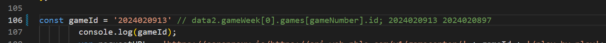
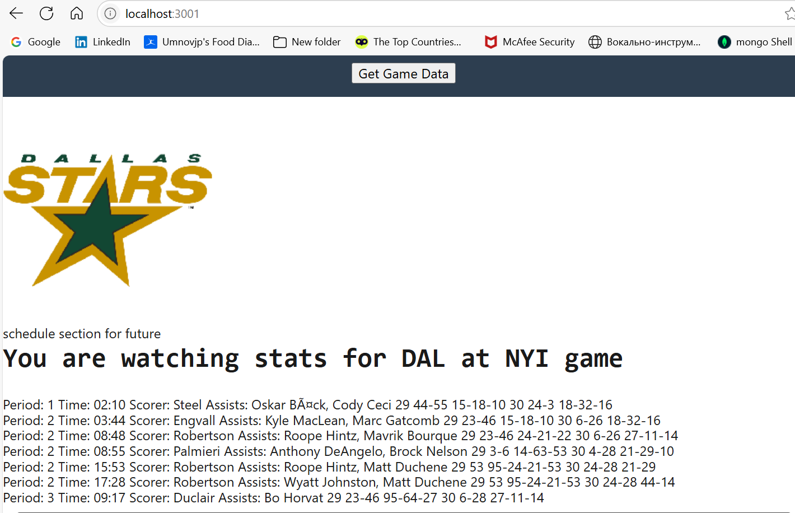
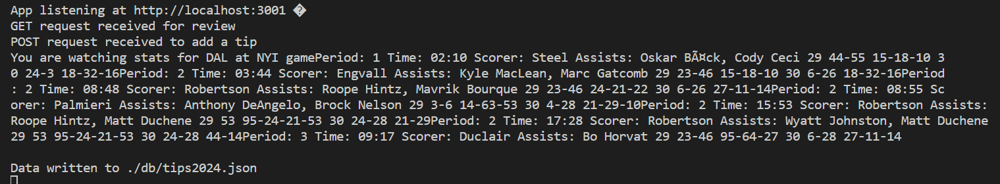
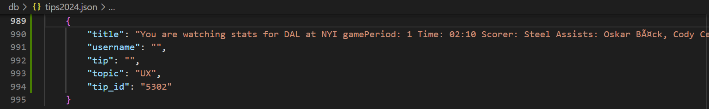

# GameDataTerminal
## Intent
This script is not intended to be a part of a large project. Instead, I copied script from my other project, NHL games blog, to make one functionality clear. I wanted to show my colleagues that as I save NHL game ID in script file, then type a command in terminal, then I can see data in terminal that come from external database. Also, I will save results to a file. That was similar to how netconf, different programming language, is used. 

## Demo
Do not forget to run `npm i` if you clone this repo. User can enter NHL game ID to script file as a string. 

It was my intention to do it this way. Then user starts script by typing node server.js. Then, after refreshing browser at localhost:3001 he will see all goals scored during this game, also scorers, assists, and player's jersey numbers who were on ice when goals were scored. 

Then after hitting 'Add your review' button and clicking OK prompt, user will find same set of data in terminal. 

User will find same set of data saved to tips2024.js file, which is emulating a database. 

To exit, enter Ctrl+C in terminal. 

## Future development
There is no plan for future development of this script. Instead look for updates in https://github.com/umnovjp/NHLGamesBlog. Unless I need to have more M2M (machine to machine) algorithms.

## Location
This repo is located in https://github.com/umnovjp/GameDataTerminal. 